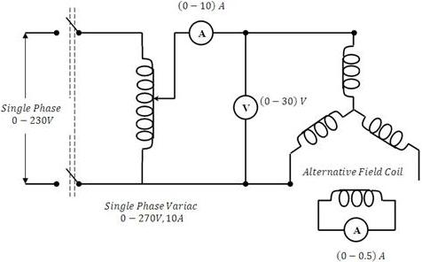

## Procedure

1. Connect as shown in Fig. 8.1. (See connection diagram)
2. Set the variac output to zero and switch on the supply.
3. Gradually increase the variac output and set armature-current to a suitable value.
4. Slowly rotate the armature and see the field current and armature current readings. Note the values of applied voltage and armature current when field current is maximum and also when it is zero.
5. Repeat step (4) for other applied voltages. Take care that armature current does not exceed its rated value while performing this experiment.

## Observations 

| S.No. | Armature Voltage (V) | Armature Current | Direct axis subtransient reactance Xd" | Qud. Axis subtransient reactance Xq" | Average Value |
|:---:|:---:|:---:|:---:|:---:|:---:|
| | Volts | at Ir max. (Amps) | at Ir=0 (Amps) | Ohms | Ohms | Xd" (Ohms) | Xq" (Ohms) |
| **1** | | | | | | | |
| **2** | | | | | | | |
| **3** | | | | | | | |
| **4** | | | | | | | |

# Connection Diagrams 

**Fig 8.1: Experimental Setup for determining Xd" and Xq"**

