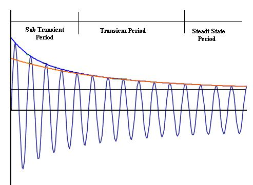
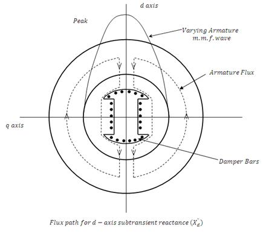
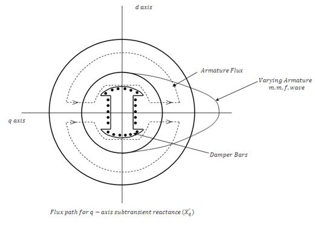
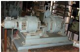
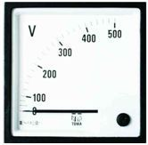
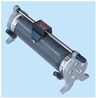
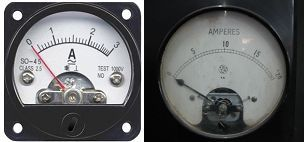

## Theory

To understand the behavior of an alternator under transient conditions, the armature and field resistance is assumed to be negligibly small. Thus, constant flux linkage theorem can be applied. As per this theorem, in purely inductive circuit, the total flux linkage cannot be changed instantaneously at the time of any disturbance. Now, if all the three phases of unloaded alternator with normal excitation are suddenly short circuited there will be short-circuit current flows in the armature. As the resistance is assumed to be zero, this current will lag behind the voltage by 90° and the m.m.f. produced by this current will be along the d-axis. First conclusion is that this current will be affected by d-axis parameters Xd, Xd' and Xd" only.

Further, there will be demagnetizing effect of this current, but as the flux linkage with field cannot change the effect of demagnetizing armature m.m.f. must be counterbalanced by a proportional increase in the field current. This additional induced component of field current gives rise to greater excitation under transient state and results in more short circuits as compared to the steady state short circuit current.

If field poles are provided with damper bars, then at the instant of three phase short circuit, the demagnetizing armature m.m.f. induces currents in damper bars, which, in turn, produces field in the same direction as the main field and hence at this instant, the excitation further increases and gives rise to further increase in short circuit armature current. This is for a very short duration, normally 3 to 4 cycles and this period is known as sub-transient period. Since the field voltage is constant, there is no additional voltage to sustain these increased excitations during sub transient or transient period. Consequently the effect of increased field current decreases with a time constant determined by the field and armature parameters and accordingly the short circuit armature current also decays with the same time constant.

**Fig 8.2: Symmetrical short circuit of an alternator**

In the above figure a symmetrical wave from for armature short circuit current of phase - A. The d.c. component is zero in this phase.

The reactances offered by the machine during sub transient period are known as sub transient reactances. Along the direct axis, it is direct axis sub transient reactance, X"d and along the quadrature axis, it is quadrature axis sub-transient reactance, X"q. As these reactances are due to the fact that flux linkages in field circuit during sudden disturbance remain constant, the sub transient reactances Xd" and Xq" can also be defined as below:

### Direct axis sub-transient reactance Xd"

The field structure is assumed to have damper bars on salient poles. The field winding is initially unexcited and is short-circuited so that field flux-linkage is zero. Armature currents now are suddenly applied in such time phase that the peak of varying armature m.m.f. wave is in direct axis. As per constant flux linkage theorem, since the flux linkage before this is zero. Hence, it remains zero just after the application of armature m.m.f. wave and in order to maintain the flux linkages zero, current are induced in damper bars, additional rotor circuit formed by pole-body etc. and the field winding. The field of the varying armature m.m.f. is forced to drive the flux through the leakage paths mainly in air as shown in Fig. 8.3.

**Fig 8.3: Flux path for d-axis subtransient reactance (Xd")**

The armature flux linkage per ampere under these conditions is known as direct axis sub transient inductance Ld".

**Fig 8.4: Flux path for q-axis subtransient reactance (Xq")**

### Quadrature axis subtransient reactance, Xq"

This also is defined in a manner similar to Xd", but in this case, armature currents are applied in such time phase that the peak of varying armature m.m.f. wave is along the quadrature axis. The damper bars in the quadrature axis force the field of the varying armature m.m.f. to follow the leakage path as shown Fig. 8.4.

As before, the flux linkage with q-axis damper bars must remain constant i.e. zero before and after the sudden application of armature m.m.f. Under these conditions, the armature flux linkages per ampere is known as q-axis sub transient inductance Lq" and Xq" = ωLq".

To determine Xd" and Xq" in laboratory, the above mentioned conditions are created there. Two phases of the three phase alternator are connected in series and the combination is connected to a low voltage single phase supply. Field winding is short circuited. The rotor is rotated and brought along the d-axis once. Xd" can be calculated from the armature current and voltage per phase of armature in this position. Next, rotor is brought along the q-axis position and Xq" is determined.

## Equipments Required 

  
| Equipment | Image |
| :--- | :--- |
| **Fig.1: Motor Generator** |  |
| **Fig.2: Voltmeter** |  |
| **Fig.3: Rheostat** |  |
| **Fig.4: Ammeter** |  |

## Video for experiment:

   

    <b style="font-size:18px">Experiment 8. To determine the sub-transient (xd&Prime;), transient (xd&prime;) and steady state reactance (xd) of a synchronous machine. Video-1</b>  
    <video width="480" height="360" controls>
        <source src="videos/Video8.mp4" type="video/mp4">
    </video>

